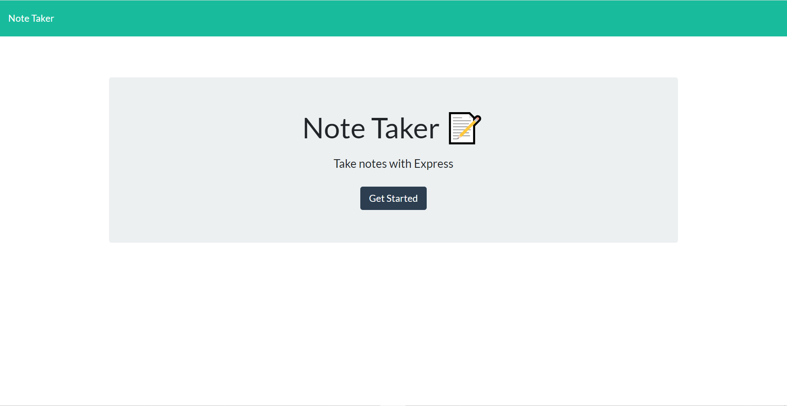
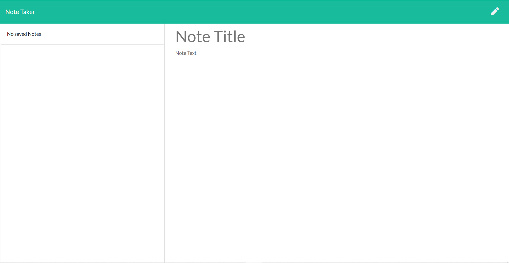
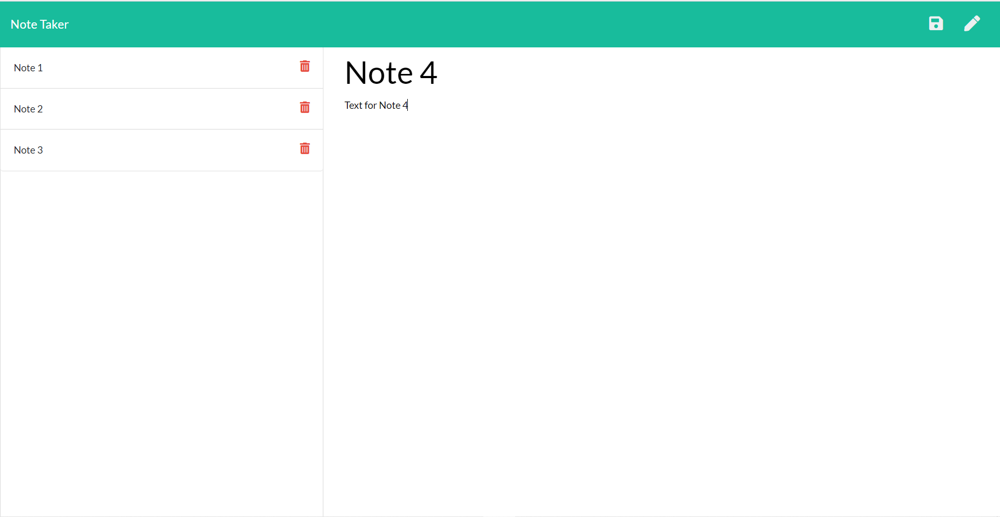

# Note-Taker

## Table of Contents
* [Description](#Description)
* [Links](#Links)
* [Design Elements](#Design-Elements)
* [App Preview](#App-Preview)
* [Credits](#Credits)

## Description
This is a note taking application similar to Evernote that can be used to write, save, and delete notes. For anyone that needs to keep track of any amount of information, this app will store all of that information in one organized format.

## Links
* Website: https://note-taker-zachdrummond.herokuapp.com/
* GitHub Repository: https://github.com/zachdrummond/note-taker

## Design Elements
### *Overview*
* Clean User Interface
* Logical Code Structure
* Sequential Order

### *JavaScript - Node.js*
* Modules
* Node Packages - File System, Path
* Node Package Manager - Express
* JSON
* Routing
* Middleware Functions
* Dynamically Updated HTML and CSS powered by jQuery
* Document Object Model Manipulation
* AJAX
* Event Listeners
* Objects
* Arrays
* Methods
* Functions
* if...else Statements
* PORTs & Environment Variables
* Comments

### *Bootstrap*
* Grid System
* Navigation Bar
* Jumbotron
* Cards
* List Group
* Containers
* Buttons
* Icons
* Sizing
* Spacing
* Alignment
* Colors

### *HTML*
* Concise Descriptive Title
* Lists
* Buttons
* Input
* Text Area
* Links

### *CSS*
* Margin & Padding
* Cursor
* Border
* Sizing
* Height and Width
* Font
* Color

## App Preview
### Home Page

### Notes Page with Zero Notes

### Notes Page with Notes

## Credits
* https://nodejs.org/en/
* https://www.npmjs.com/
* http://expressjs.com/
* https://www.npmjs.com/package/nodemon
* https://jquery.com/
* https://getbootstrap.com/
* https://fontawesome.com/
